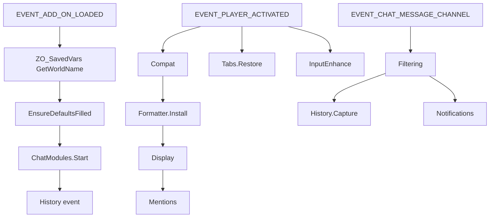

# Architecture

EsoChat enhances Elder Scrolls Online **keyboard** chat: display formatting, mentions, notifications, history, tabs, filtering, copy/export, and optional automation.

## Manifest load order

1. `src/Core.lua` — namespace, SafeCall, logging
2. `src/i18n/{en,de,fr}.lua` — `EC.L` strings
3. `src/settings/Defaults.lua` / `Initializer.lua`
4. `src/chat/*` — feature modules (Display → … → ChatModules)
5. `src/Commands.lua`
6. `src/settings/SupportFooter.lua` / `Panel.lua`
7. `src/Init.lua` — SavedVars, EnsureDefaultsFilled, start modules (must be last)

## Runtime flow

## Namespace

| Token | Value |
|-------|--------|
| Global | `EsoChat` |
| Alias | `EC` |
| SavedVariables | `EsoChatSettings` |
| Slash | `/ech` |

## Schema

`settingsSchemaVersion` is **1** (greenfield). Missing keys are filled non-destructively via `EC.EnsureDefaultsFilled` — there is no migration ladder.
