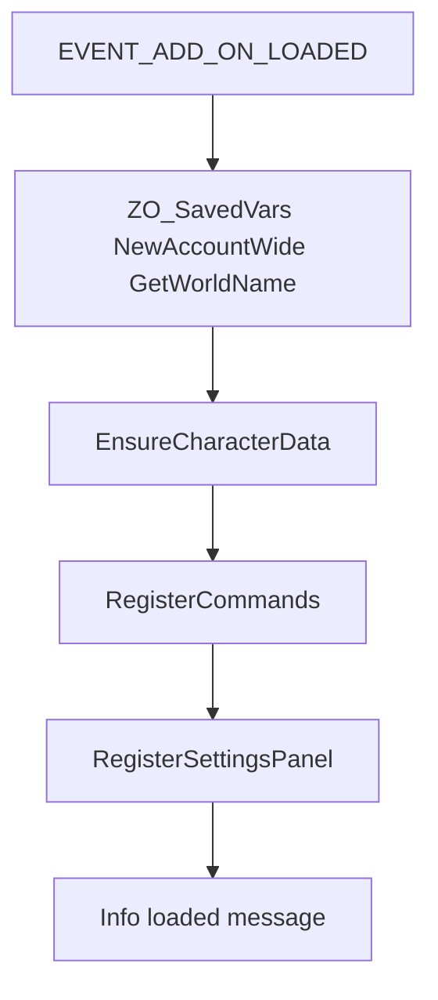

# Architecture

Minimal load order for the solaegis ESO addon scaffold.

## Manifest load order

1. `src/Core.lua` — namespace, SafeCall, logging, branding constants
2. `src/settings/Defaults.lua` — SavedVariables defaults + reset
3. `src/settings/Initializer.lua` — per-character bucket helpers
4. `src/Commands.lua` — slash commands
5. `src/settings/SupportFooter.lua` — Buy Me a Coffee + in-game gold
6. `src/settings/Panel.lua` — LibAddonMenu panel
7. `src/Init.lua` — `EVENT_ADD_ON_LOADED`, server-scoped SavedVars (must be last)

## Runtime flow

## Namespace

| Token | Template default | Meaning |
|-------|------------------|---------|
| Global | `EsoChat` | ESO folder / manifest basename |
| Alias | `EC` | Short Lua alias |
| SavedVariables | `EsoChatSettings` | Account-wide SV table name |
| Slash | `/ech` | Primary command |

Run `scripts/rename-addon.sh` before shipping so these match your product.

## Adding modules

- Place new Lua under `src/` (or `src/<area>/`)
- Append paths to `EsoChat.txt` **before** `src/Init.lua`
- Keep Init thin: register events and wire modules; put logic in named modules
